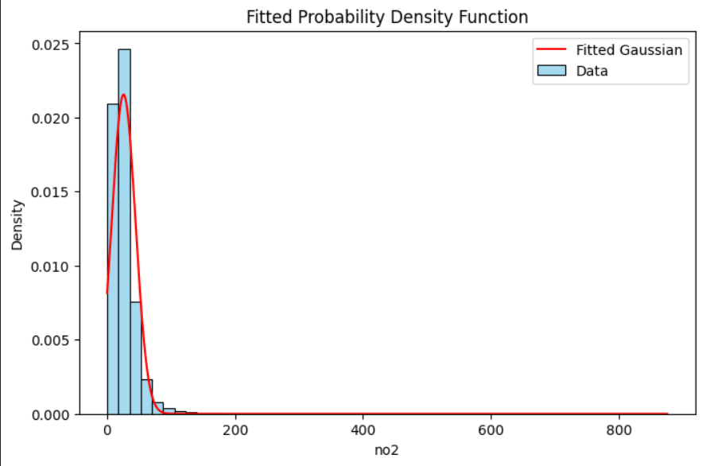

# Learning Probability Density Functions using Roll-Number Parameterized Non-Linear Model

---

## Objective

The objective of this assignment is to:

1. Transform the NO₂ feature using a roll-number-dependent nonlinear function.
2. Learn the parameters of a probability density function:
   
    $$
    \hat{p}(z) = c \cdot e^{-\lambda (z-\mu)^2}
    $$


3. Estimate the parameters \( \lambda \), \( \mu \), and \( c \).

---

## Dataset

The dataset used in this assignment is publicly available on Kaggle:
https://www.kaggle.com/datasets/shrutibhargava94/india-air-quality-data
Due to size limitations, the dataset file is not included in this repository.  

---

## Step-1: Roll Number Based Transformation

Transformation formula:

$$
z = x + a_r \sin(b_r x)
$$

Where:

$$
a_r = 0.05 \times (r \mod 7)
$$
$$
b_r = 0.3 \times (r \mod 5 + 1)
$$

Roll Number:
```
r = 102303796
```

Computation:
```
r mod 7 = 0
a_r = 0
r mod 5 = 1
b_r = 0.6
```

Since:

$$
a_r = 0
$$

The transformation simplifies to:

$$
z = x
$$

---

## Step-2: Learning the Probability Density Function

We assume:

$$
\hat{p}(z) = c \cdot e^{-\lambda (z-\mu)^2}
$$

This is equivalent to a Gaussian distribution.

From Gaussian properties:

$$
\lambda = \frac{1}{2\sigma^2}
$$

$$
c = \frac{1}{\sqrt{2\pi\sigma^2}}
$$

Where:
- μ = Mean of data  
- σ² = Variance of data 

---

## Learned Parameters

| Parameter | Value |
|------------|--------|
| μ | 25.8096 |
| λ | 0.001460 |
| c | 0.021561 |

---

## Visualization

The fitted Gaussian distribution closely follows the histogram of NO₂ values.
- Blue: Empirical data density
- Red: Learned Gaussian PDF



---

## Technologies Used

- Python
- Pandas
- NumPy
- Matplotlib
- Seaborn

---

## Method Used

Parameter estimation was performed using:

- **Method of Moments**
  - Mean estimated using sample mean
  - Variance estimated using sample variance
  - λ and c derived analytically

---

## Key Learning Outcomes

- Understanding nonlinear feature transformation
- Relationship between exponential quadratic form and Gaussian PDF
- Parameter estimation using statistical properties
- Visualization of probability density functions

---

## Conclusion

The assignment successfully demonstrates learning of a probability density function from transformed data using roll-number-parameterized nonlinear modeling.


